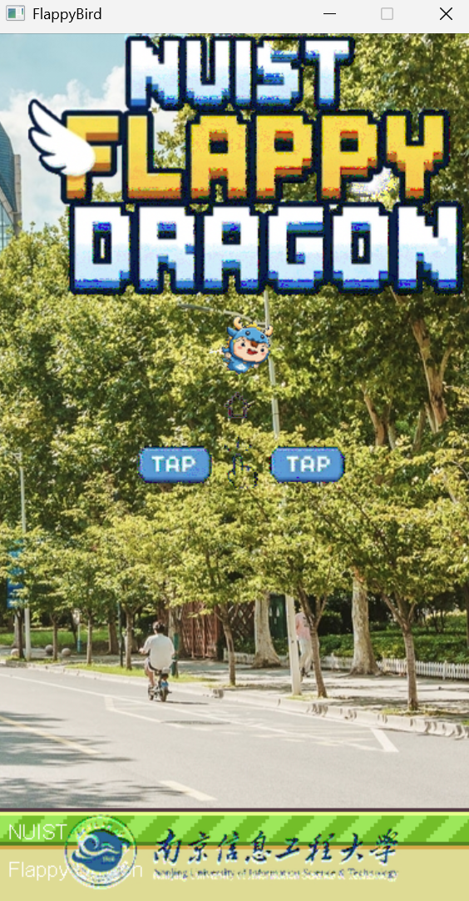
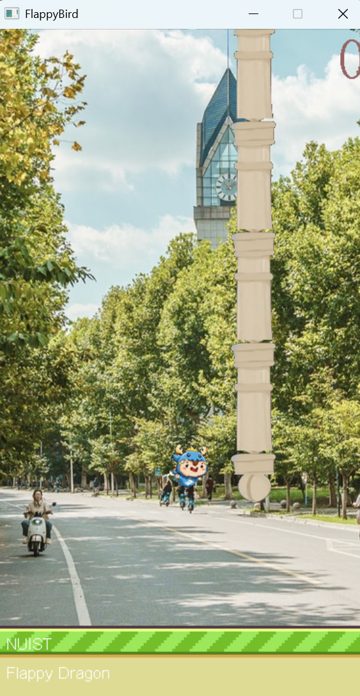
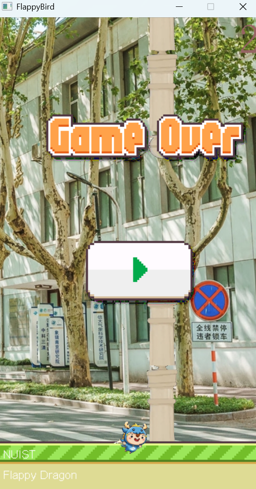
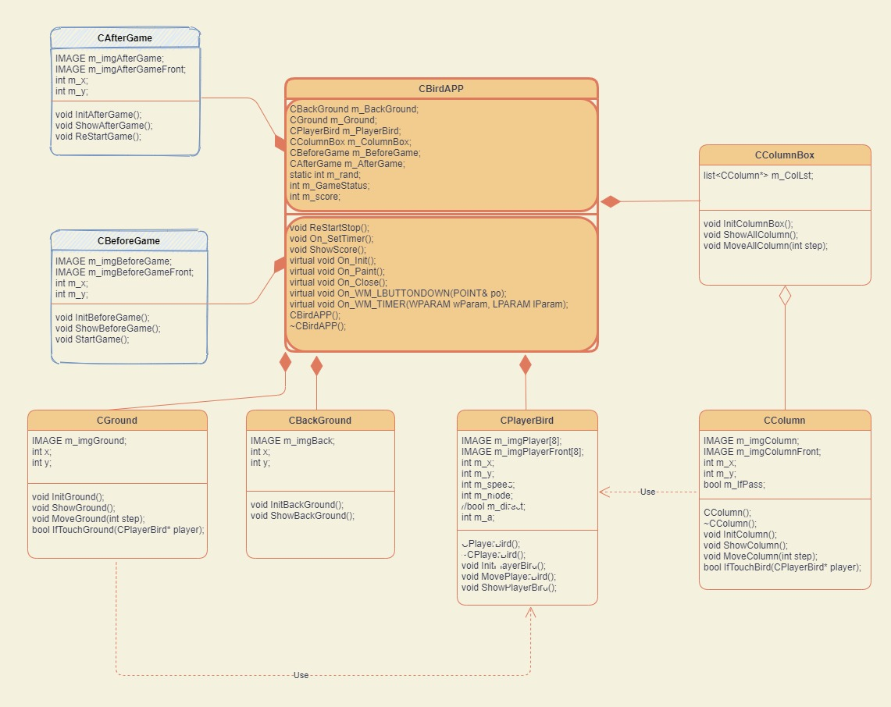

# NUIST Flappy Dragon 🐉

南京信息工程大学 C++ 课程项目，基于 EasyX 图形库的 Flappy Bird 小游戏。

点击屏幕控制小龙飞行，穿越柱子，挑战最高分！

## 项目结构

- `CBirdAPP` — 游戏主控类，管理状态与核心逻辑
  - `CBackGround` — 背景
  - `CGround` — 地面
  - `CPlayerBird` — 玩家小鸟
  - `CColumnBox` — 柱子管理
  - `CBeforeGame` — 开始界面
  - `CAfterGame` — 结束界面

## 环境要求

- Windows + Visual Studio
- EasyX 图形库

## 致谢

- 灵感来源于 Flappy Bird
- 南京信息工程大学课程实践

如果对你有帮助，点个 ⭐️ Star 吧！
